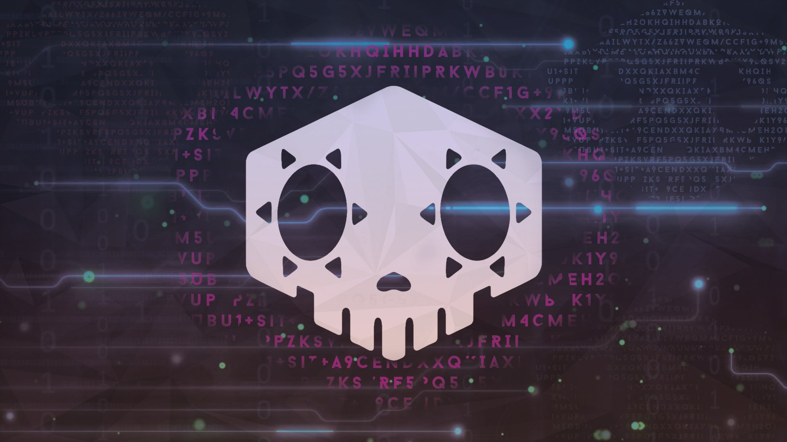

# dotfiles



Cross-platform shell + terminal setup. Same nu config and WezTerm config on Mac, Linux, and Windows.

## Layout

- `nu/env.nu`, `nu/config.nu` - entry points sourced by nushell at startup. `env.nu` runs first, sets env and PATH, sources the right host file.
- `nu/hosts/{macos,linux,windows}.nu` - per-host PATH and tooling. Picked automatically via `$nu.os-info.name`.
- `nu/ssm-env.nu` - in-process AWS SSM secret loader. Replaces the old `~/.cache/ssm-env.sh` cleartext dump. Run `ssm-load` when you need secrets in your env. Nothing ever hits disk.
- `wezterm/wezterm.lua` - terminal config. Single file for all three OSes. Windows entry includes a shell picker (Nushell / Git Bash / PowerShell / cmd).
- `hammerspoon/init.lua` - Mac-only. Auto-presses Return after Wispr Flow finishes pasting dictated text, with a Cmd+A verify-and-retry pass for the times the first Return doesn't submit.
- `scripts/` - portable utilities not specific to nu or wezterm.
  - `gpg-doctor.nu` - diagnose gpg signing setup.
  - `verbatim-echo.sh` - wrap a command's output in a fenced block clipped to 20 lines / 100 chars per line. Chat-safe dumps for mobile.
  - `check-aws-config.py` - reject the `[profile default]` trap in `~/.aws/config` that surfaces later as a cryptic `NoRegion` from SSM/S3.
  - `gpg-ssm` / `gpg-ssm.cmd` - GPG signing wrapper that pulls the passphrase from AWS SSM at `/coilysiren/gpg-passphrase/<keyid>` instead of caching it on disk. Wire-up Mac/Linux: `git config --global gpg.program "$HOME/.local/bin/gpg-ssm"`. Wire-up Windows: same but point at `gpg-ssm.cmd`, a bash.exe shim Git for Windows needs because it can't invoke extensionless shebang scripts reliably.
  - `check-commit-closes-issue.py` - commit-msg hook rejecting commits that lack a same-repo `closes #N` / `fixes #N` / `resolves #N`.
- `.claude/skills/` - SKILL.md docs for the configs that live here. `tooling-nushell`, `tooling-wezterm`, `tooling-hammerspoon`, `tooling-gpg-ssm`. Coilyco-ai's `setup.sh` walks this dir as a peer skill source, symlinking each entry into `~/.claude/skills/`. Co-located with the configs they describe so they don't drift.

## Install

### Mac

```bash
brew install nushell wezterm
NU_CONFIG="$HOME/Library/Application Support/nushell"
mkdir -p "$NU_CONFIG"
ln -sf "$PWD/nu/env.nu" "$NU_CONFIG/env.nu"
ln -sf "$PWD/nu/config.nu" "$NU_CONFIG/config.nu"
ln -sf "$PWD/nu/ssm-env.nu" "$NU_CONFIG/ssm-env.nu"
ln -sf "$PWD/nu/hosts" "$NU_CONFIG/hosts"
ln -sf "$PWD/wezterm/wezterm.lua" ~/.wezterm.lua
mkdir -p ~/.hammerspoon
ln -sf "$PWD/hammerspoon/init.lua" ~/.hammerspoon/init.lua
mkdir -p ~/.local/bin
ln -sf "$PWD/scripts/gpg-ssm" ~/.local/bin/gpg-ssm
```

Optional - set nu as login shell:

```bash
echo "$(which nu)" | sudo tee -a /etc/shells
chsh -s "$(which nu)"
```

### Linux (kai-server)

```bash
brew install nushell wezterm  # or distro package
mkdir -p ~/.config/nushell
ln -sf "$PWD/nu/env.nu" ~/.config/nushell/env.nu
ln -sf "$PWD/nu/config.nu" ~/.config/nushell/config.nu
ln -sf "$PWD/nu/ssm-env.nu" ~/.config/nushell/ssm-env.nu
ln -sf "$PWD/nu/hosts" ~/.config/nushell/hosts
ln -sf "$PWD/wezterm/wezterm.lua" ~/.wezterm.lua
mkdir -p ~/.local/bin
ln -sf "$PWD/scripts/gpg-ssm" ~/.local/bin/gpg-ssm
```

### Windows (Git Bash)

```bash
winget install Nushell.Nushell wez.wezterm-nightly
mkdir -p "$APPDATA/nushell"
cp nu/env.nu nu/config.nu nu/ssm-env.nu "$APPDATA/nushell/"
cp -r nu/hosts "$APPDATA/nushell/"
cp wezterm/wezterm.lua "$USERPROFILE/.wezterm.lua"
mkdir -p ~/.local/bin
cp scripts/gpg-ssm scripts/gpg-ssm.cmd ~/.local/bin/
```

(Windows symlinks need admin or developer mode, so copy is simpler. Re-run after edits.)

## Secrets pattern

The legacy pattern wrote all SSM SecureStrings to `~/.cache/ssm-env.sh` and sourced it from `.zshenv`. That cleartext-on-disk dump has been deleted.

The new pattern:

```nu
ssm-load                          # pull every / parameter into current process env
ssm-get /eco/server-api-token     # fetch one value without storing it
```

No disk write at any point. Same call works on Mac, Linux, Windows. AWS profile defaults to `coilysiren`; override with `--profile`.

If you want secrets at shell startup, append `ssm-load` to the end of `nu/config.nu`. Default behavior is opt-in per shell.

## What's not here (yet)

- `direnv` hook for nu - separate install, optional.
- Login-shell switching - documented above, not automated.
- Work machine config stays on zsh per its bash-script dependencies. This repo is personal-only.

## Credits

- `static/wallpaper.jpg` - Sombra hacking skull, from the [Overwatch](https://overwatch.blizzard.com) Sombra ARG promotional materials, Blizzard Entertainment, circa 2016. All Overwatch art and iconography © Blizzard Entertainment. Used here for personal terminal decoration only.
